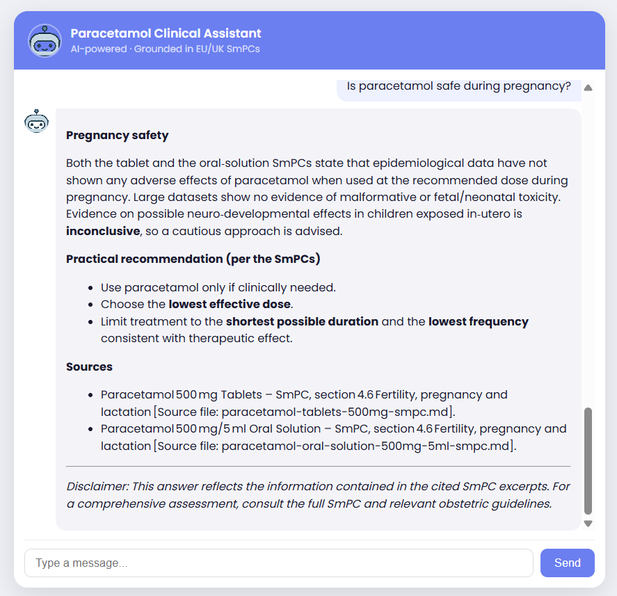
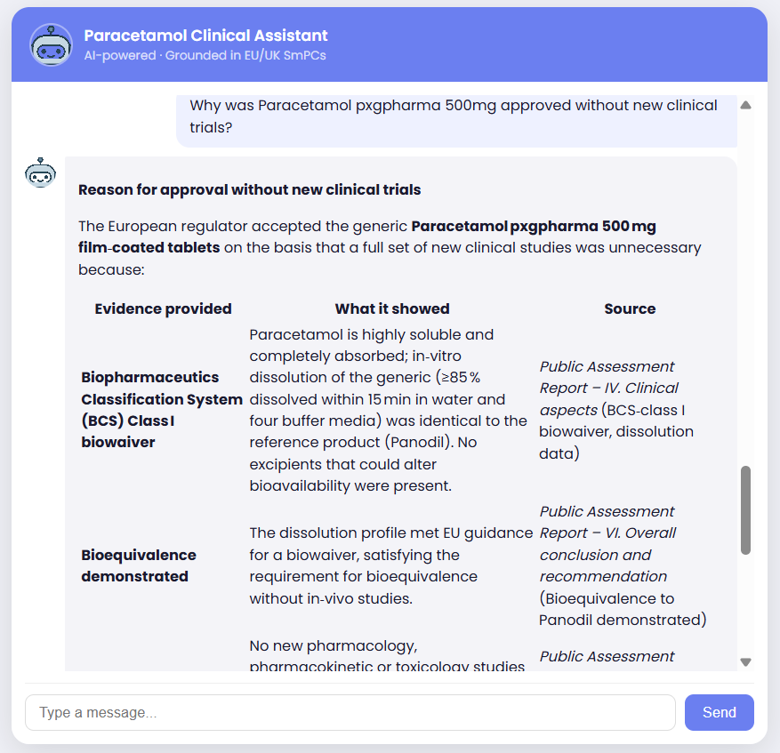
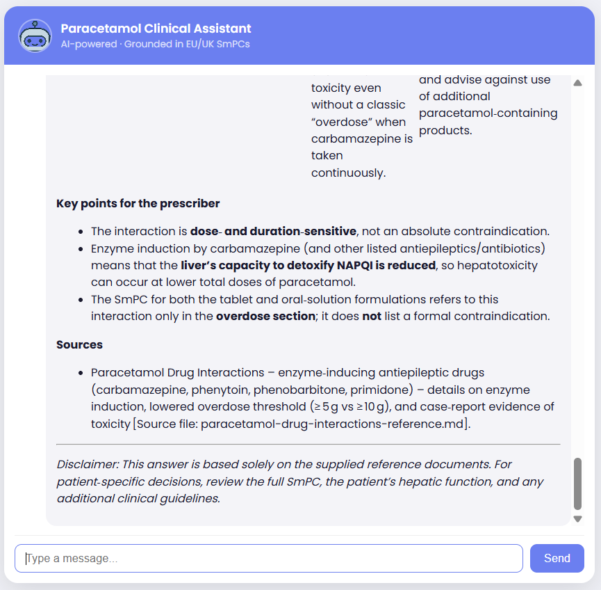
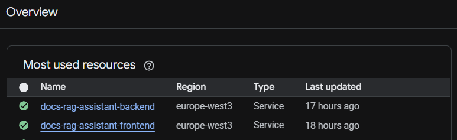
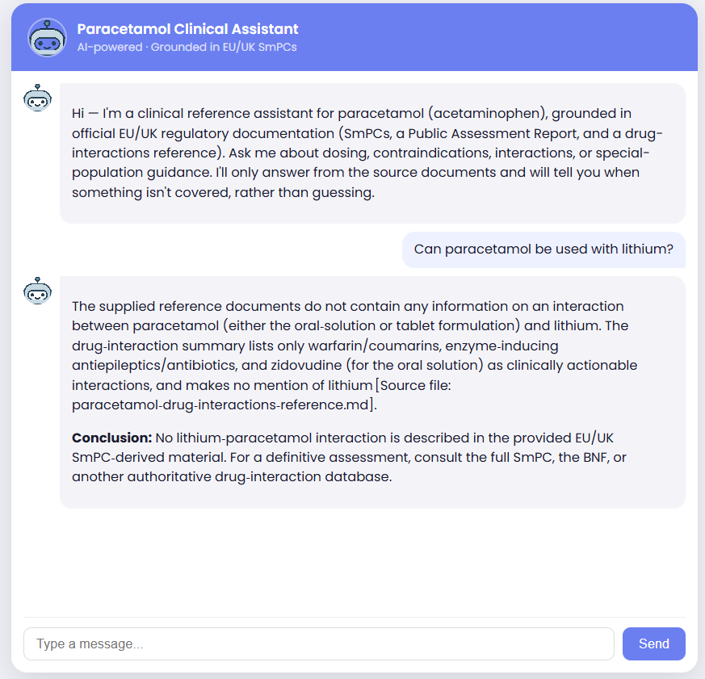

# Paracetamol Clinical Reference Assistant

A RAG-based conversational assistant that answers clinical questions about paracetamol (acetaminophen) — dosing, contraindications, interactions, and special-population guidance — grounded in official EU/UK regulatory documentation. Built for healthcare professionals as a fast, cited reference lookup tool, not a replacement for the full SmPC, BNF, or clinical judgement.

Built as a take-home assignment for a Full Stack Engineer role.

---

## Screenshots

**Grounded, cited answer with genuine nuance** (pregnancy safety — reports what the data does and doesn't show, rather than a flat yes/no):



**Reasoning from a different document genre** (the Public Assessment Report, covering regulatory rationale rather than product information):



**Drawing on the synthesised interactions reference** for detail beyond what the SmPCs alone state:



Additional screenshots (welcome screen, guardrail refusal, deployment) appear inline further down, next to the sections they support.

---

## Quick setup instructions

**Live deployment** (no setup required):
- Frontend: https://docs-rag-assistant-frontend-224143145108.europe-west3.run.app
- Backend health check: https://docs-rag-assistant-backend-224143145108.europe-west3.run.app

**To run locally instead:**

**Backend:**
```
cd backend
python -m venv venv
venv\Scripts\Activate.ps1      # Windows; use venv/bin/activate on macOS/Linux
pip install -r requirements.txt
python app/rag/ingest.py       # builds the ChromaDB vector store from data/knowledge/*.md
uvicorn app.main:app --reload
```

**Frontend:**
```
cd frontend
npm install
npm start
```

Requires a `.env` file in `backend/` with a `GROQ_API_KEY` (free tier available at console.groq.com).

---

## Architecture overview

```
frontend (Angular)  →  FastAPI backend  →  ChromaDB (local persistent vector store)
                              ↓
                        Groq API (openai/gpt-oss-120b)
```

- **Ingestion** (`app/rag/ingest.py`): reads a fixed collection of Markdown documents from `data/knowledge/`, chunks them by `##` heading, and embeds them into a local ChromaDB collection using Chroma's built-in embedding function.
- **Retrieval** (`app/rag/answer.py`): on each question, queries ChromaDB for the top-5 most relevant chunks, keeping each chunk's source filename attached via metadata.
- **Generation**: retrieved chunks are assembled into a labelled context block and sent, along with a system prompt and conversation history, to Groq's hosted LLM. The response is grounded in — and cites — the retrieved source documents.
- **Session handling**: conversation history is kept in-memory on the backend, keyed by a session ID generated client-side.

### Example queries

A few questions worth trying against the live deployment, each exercising a different part of the knowledge base:

- *"What's the difference in warnings between the tablet and oral solution formulations?"* — cross-document comparison between the two SmPCs.
- *"Can paracetamol be used with carbamazepine?"* — draws on the drug-interactions reference specifically, covering detail beyond what the SmPCs alone state.
- *"Why was Paracetamol pxgpharma 500mg approved without new clinical trials?"* — draws on the Public Assessment Report, a different document genre from the SmPCs (regulatory rationale rather than product information).
- *"What sections does an SmPC normally include?"* — draws on the EMA explainer, a meta-document about structure rather than paracetamol content itself.
- *"Is paracetamol safe during pregnancy?"* — tests whether the assistant reports genuine nuance (no ill effects shown at recommended dose in epidemiological data, but neurodevelopmental data described as inconclusive) rather than an oversimplified yes/no.

---

## Deployment

Both services are deployed as separate Cloud Run services in the same GCP project, built and deployed with a single command each:

```
gcloud run deploy docs-rag-assistant-backend --source . --platform managed --region europe-west3 --allow-unauthenticated --max-instances 2 --set-env-vars GROQ_API_KEY=<key>
gcloud run deploy docs-rag-assistant-frontend --source . --platform managed --region europe-west3 --allow-unauthenticated --max-instances 2
```

`--source .` uploads the local directory and has Google Cloud Build build the image remotely from the Dockerfile in that directory, push it to Artifact Registry, and deploy it to Cloud Run — no local Docker installation is required. I used this route deliberately after running into a virtualization/BIOS issue with Docker Desktop on a new laptop; rather than debug local virtualization settings, offloading the build to Cloud Build sidesteps the problem entirely, and is a genuinely normal way to deploy to Cloud Run regardless.

The backend's `Dockerfile` builds directly into a runnable Python container. The frontend's `Dockerfile` uses a multi-stage build: a `node:20-alpine` stage compiles the Angular/TypeScript source into static HTML/CSS/JS, then a separate, much smaller `nginx:alpine` stage serves only that compiled output. TypeScript and the Node toolchain exist only during the build stage and are not present in the final running container — the container's only runtime job is serving pre-built static files.



### What would be required to productionize this further, at scale, on a hyperscaler
- **Secrets management**: the Groq API key is currently passed via `--set-env-vars`, which is visible in plaintext in the Cloud Run console and shell history. A production deployment should use Google Secret Manager instead, injected at runtime.
- **CI/CD**: deploys are currently manual, one command per service. A production setup would wire this to Cloud Build triggers on git push, or a GitHub Actions workflow, so deployment is automatic and consistent rather than a developer running a local command.
- **Session storage**: conversation history is in-memory per container instance, so it does not survive a restart and would not work correctly if Cloud Run scaled to multiple instances behind a load balancer, since a follow-up message could land on a different instance with no memory of the earlier turns. A production version would move session state to a shared store such as Redis or Firestore.
- **Vector database**: ChromaDB currently runs as an embedded, file-based database baked into the container image at build time. This works for a small, fixed document collection but would not scale to a larger or frequently-updated corpus, or to multiple backend instances needing consistent access to the same index. A production version would use a managed vector database (e.g. a hosted ChromaDB deployment, Pinecone, or Vertex AI Vector Search) decoupled from the application container.
- **Observability**: no structured logging, tracing, or monitoring is currently in place beyond Cloud Run's default request logs. A production deployment would add structured logging of retrieved chunks, latency, and LLM calls (e.g. via Cloud Logging with structured payloads, or an observability tool such as Langfuse), plus alerting on error rates or latency regressions.
- **Rate limiting and authentication**: the API is currently open and unauthenticated. A production deployment behind real usage would need at minimum rate limiting, and likely authentication appropriate to a healthcare-professional-facing tool.
- **Autoscaling tuning**: `--max-instances 2` was set conservatively for a demo deployment; production scaling limits and concurrency settings would need to be tuned against real expected traffic.

---

## RAG / LLM approach & decisions

### Document collection
I chose a small, curated set of public EU/UK regulatory documents about a single well-known medicine (paracetamol) rather than a broad or user-uploadable corpus.

Newpage Solutions works substantially in pharma and life sciences digital health, so I built something genuinely relevant to that domain rather than a generic demo, while staying entirely within public, freely-usable sources. Regulatory and clinical documents are also a legitimately harder retrieval problem than casual text — dense, cross-referencing, formulation-specific — and it's exactly the kind of domain where hallucination risk matters, which gives the guardrail work real stakes rather than being a box-ticking exercise.

I kept the collection to five documents deliberately, rather than an exhaustive "encyclopedia" of paracetamol literature. The goal was depth and a defensible retrieval story on a bounded set, not maximum coverage.

The five documents:
1. `paracetamol-tablets-500mg-smpc.md` — UK SmPC, oral tablet formulation
2. `paracetamol-oral-solution-500mg-5ml-smpc.md` — UK SmPC, oral solution formulation. It has a different paediatric cutoff, different excipient warnings, and a different interaction list than the tablet — included deliberately to test whether retrieval correctly distinguishes formulation-specific detail rather than blending the two.
3. `paracetamol-public-assessment-report.md` — a Dutch/EU decentralised-procedure Public Assessment Report. A different genre of document from the SmPCs: regulatory rationale (why a generic was approved) rather than product information.
4. `ema-smpc-explainer.md` — EMA's own reference on SmPC structure, used as a meta-document to confirm the SmPCs above follow the structure I assumed they did.
5. `paracetamol-drug-interactions-reference.md` — a synthesised secondary reference, built from a PubMed review, a hospitalised-geriatric-patients study, and a warfarin-interaction evidence summary. Covers interaction depth beyond what the SmPCs alone state, included specifically to support harder "lesser-known interaction" questions.

All source documents are cited with their origin URL at the top of each file. The interactions reference file is explicitly flagged as a compiled secondary source, not a primary regulatory document, to be transparent about that distinction.

### Chunking
I chunk by `##` section headings within each document (e.g. "4.5 Interactions"), prepending the document's H1 title to each chunk for context.

During testing I caught a real bug in my first pass: it took everything before the first `##` as the "title," which included not just the H1 but an entire metadata block (source URL, retrieval date, document type). Every chunk from a file was repeating that whole block, wasting retrieval context budget on duplicated boilerplate instead of actual content. I fixed it to extract only the first line as the title, and verified the fix by re-running the same test query before and after, confirming the retrieved chunks got measurably leaner without losing relevance.

### Embedding model
I use ChromaDB's built-in default embedding function rather than a separately-loaded model such as `sentence-transformers`. On an earlier project, dropping `sentence-transformers` cut the Docker image from roughly 9GB to 1GB, and the same rationale applies here.

One consequence worth noting: any script that queries the collection has to use the same `query_texts` pathway as ingestion, not a separately-loaded embedding model. I found and fixed exactly this inconsistency during development — a leftover debug script was loading its own embedding model, which would have silently searched a different embedding space than the one the collection was actually built with.

### LLM selection
I use Groq's hosted `openai/gpt-oss-120b`. I originally used `llama-3.3-70b-versatile`, but discovered during testing that Groq deprecated this model, which surfaced as a live 404 error — a good reminder that hosted-model dependencies need active maintenance, not "set and forget." I chose the 120B variant over the smaller 20B option given the precision-sensitive reasoning the clinical use case calls for: correctly distinguishing formulations, doing dosing arithmetic, and declining out-of-scope questions rather than guessing.

### Prompt & context management
The system prompt instructs the model to answer only from retrieved context, cite the specific source file(s), state explicitly when documents differ (e.g. tablet vs. oral solution) rather than blending them, and refuse rather than guess when the context doesn't cover the question.

Retrieved chunks are labelled with their source filename before being handed to the model, so citation is grounded in real metadata rather than the model inferring or guessing a source.

A fresh query currently sits around 1,000-1,500 tokens (system prompt plus five retrieved chunks), well under the model's context window. The one real scaling concern is conversation history: it is currently stored and resent in full, uncapped, on every turn. For a longer-running production conversation this would need capping — for example keeping the last N turns verbatim and summarising older turns, or truncating by token budget. This is a known, named limitation rather than an unconsidered one.

### Guardrails and quality testing
Rather than assume the prompt worked, I tested it against three specific scenarios and confirmed correct behaviour in each:

1. **Cross-document synthesis** — asked about a documented interaction (warfarin), the assistant correctly pulled from both the tablet SmPC and the separate interactions reference, cited both, and did not blend them into an unsupported single claim.
2. **Out-of-scope refusal** — asked about an interaction not in the knowledge base (lithium), the assistant correctly declined to speculate, explicitly named what is covered instead, and pointed to an appropriate fallback (full SmPC/BNF) rather than guessing from the underlying model's general training knowledge.


3. **Formulation discrimination and arithmetic** — asked for a 12-year-old's maximum daily dose, the assistant correctly selected the tablet formulation (the oral solution is contraindicated under 16), retrieved the correct dosing line, and correctly computed 4 × 500mg = 2g rather than simply restating a retrieved sentence.
4. Retrieval tuning discovery — asking for posology for "a 150 kg overweight male" initially returned a refusal, even though standard adult dosing information was present in the knowledge base. The unusual phrasing pulled retrieval toward semantically similar but less relevant chunks (indications, adverse effects) rather than the actual posology section, at the default of 5 retrieved chunks. Increasing n_results from 5 to 8 improved this — the posology section was included more often, and the model correctly reasoned about the absence of weight-based dosing rather than hallucinating a number when it was included — but it did not fully resolve the issue: on repeat testing with the same question, the assistant sometimes still returned a refusal. This is a real, only partially fixed retrieval-quality issue, not a prompt or refusal-logic problem. A more robust fix would be a retry mechanism: if the model determines the retrieved context is insufficient to answer, trigger a second retrieval pass (e.g. with a higher n_results, a reformulated query, or both) before falling back to a refusal, rather than relying on a single retrieval attempt to succeed. I didn't have time to implement this — see "What I'd do differently" below.

---

## Key technical decisions and why

- **Monorepo structure** (`backend/` and `frontend/` in one repository) rather than two separate repos, matching the assignment's framing as a single fullstack deliverable and simplifying setup and review.
- **In-memory session storage** rather than a database. Appropriate for this assignment's scope; it would not survive a server restart, which is an explicit, acceptable trade-off here rather than an oversight (see Known limitations).

---

## Engineering standards followed (and some I skipped)

**Followed:**
- Environment variables and secrets kept out of git via `.gitignore` — the API key lives in `.env` and was never committed.
- Dependency isolation via a virtual environment (backend) and `node_modules` (frontend), both excluded from version control.
- Verified retrieval quality independently of generation quality before layering the LLM on top — I tested the retrieval step on its own before testing full answer generation, rather than debugging both at once.
- Iterative, test-driven prompt development. Every guardrail claim in this README is backed by an actual test run I carried out and read the output of, not an assumption.

**Skipped, given the time constraints of a take-home assignment:**
- Automated test suite
- Structured logging / observability
- Rate limiting or authentication on the API
- Conversation history capping

---

## How I used AI tools in my development process

I used Claude throughout development. I make sure I write a comprehensive prompt and reason with it before generating code. I explain what it is that I need, I ask for a list of options and I ask it to give me the pros and cons of the technologies. If Claude suggests a technology I don't know, I make my own research independent from AI (Reddit, Google) and I look for possible problems (especially on Reddit). I submit such problems to at least 3 AI models and see what comes up. If I'm not convinced I join conversations on Discord and ask a human about it. The process of generating code only comes after. And even when the code is generated I check every single line, ask questions, and never let the LLM go unsupervised.

Claude helped me diagnose a handful of real bugs as they came up: a venv that silently pointed back at an old project's Python installation after a folder copy, a git-tracking issue where a stale .gitignore pattern let a virtual environment get committed, the chunking bug described above, and a deprecated Groq model that only surfaced as a live API error.

I deliberately didn't let it generate a system prompt and ship it unexamined. Every guardrail claim in this README is backed by a test I ran myself and read the output of — the warfarin, lithium, and paediatric-dosing scenarios above were my own test design.

My general approach with AI coding assistants is to use them heavily for diagnosis, boilerplate, and explaining unfamiliar territory (this was my first substantial Python project, so a lot of the value was in mapping Python/FastAPI concepts back to patterns I already knew from TypeScript), while keeping decisions that affect correctness or safety — what goes in the knowledge base, how the system prompt constrains the model, what counts as a passing guardrail test — under my own direct judgement and verification.

---

## What I'd do differently with more time

- Add conversation history capping or summarisation for longer sessions.
- Add an automated test suite: retrieval returning the expected source for known queries, and basic endpoint smoke tests.
- Add structured logging of retrieved chunks, latency, and LLM calls for observability.
- Expand guardrail testing beyond the three manual scenarios into a small, repeatable evaluation set.
- Add a retry mechanism for retrieval: if the model judges the retrieved context insufficient to answer a question, trigger a second retrieval pass (higher n_results, a reformulated query, or both) before falling back to a refusal. This came directly out of testing — increasing n_results from 5 to 8 measurably improved but did not fully resolve inconsistent retrieval on unusually-phrased questions (see the retrieval tuning discovery above), and a single-shot retrieval is inherently fragile to phrasing in a way a retry step would help with. I'd implement this as a small loop in answer.py: have the model (or a lightweight check) flag when its own answer would be a refusal due to missing context, then re-run retrieve_context() with an adjusted query or higher n_results before generating the final response, rather than accepting the first retrieval pass unconditionally.
- Add a dedicated calculation tool rather than relying on the LLM to do dosing arithmetic inline. In testing, the model correctly computed a paediatric maximum daily dose (4 × 500mg = 2g), but LLM arithmetic isn't reliably correct in general — I've seen this firsthand doing agent work at Wonderful AI, where even simple calculations aren't always dependable when left to the model itself. For a clinical dosing tool specifically, a silent arithmetic error is a real risk, not just a minor inconvenience, so any dose calculation should be handled by a deterministic function call rather than the model's own generation.

---

## Known limitations

- In-memory session storage does not survive a server restart.
- The document collection is fixed, with no live document upload — a deliberate interpretation of the assignment's "document collection" requirement, not a missing feature.
- Conversation history is not capped, so a very long conversation would grow the prompt's token count linearly with no upper bound.
- Testing has covered three targeted scenarios rather than a broader or adversarial evaluation set.
- Wide markdown tables (4+ columns) in bot responses can require horizontal scrolling within the message bubble that isn't fully polished — a minor UI issue, deprioritized in favor of the core RAG functionality and guardrail testing given time constraints.
